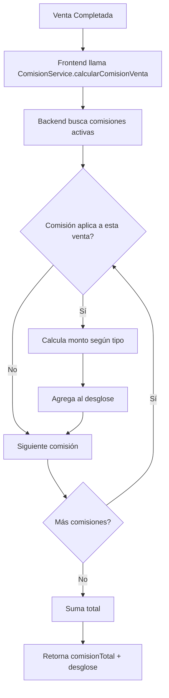

# 🎯 Sistema de Comisiones - Documentación

## 📋 Visión General

El sistema de comisiones es flexible y permite configurar diferentes tipos de comisiones que se calculan automáticamente en cada venta.

---

## 🏗️ Arquitectura del Sistema

### 1️⃣ Base de Datos (Tabla `comisiones`)

```sql
CREATE TABLE comisiones (
  id UUID PRIMARY KEY DEFAULT uuid_generate_v4(),
  nombre VARCHAR(255) NOT NULL,
  descripcion TEXT,
  tipo_comision VARCHAR(50) NOT NULL, -- 'porcentaje' o 'monto_fijo'
  valor NUMERIC(10, 2) NOT NULL,
  aplica_a VARCHAR(50) NOT NULL, -- 'todos', 'empleado', 'categoria', 'producto'
  referencia_id UUID, -- ID del empleado, categoría o producto según aplica_a
  fecha_inicio DATE,
  fecha_fin DATE,
  activo BOOLEAN DEFAULT true,
  created_at TIMESTAMP DEFAULT CURRENT_TIMESTAMP
);
```

#### Tipos de Comisión:

- **`porcentaje`**: Se aplica un % del monto de la venta (ej: 5%)
- **`monto_fijo`**: Se aplica un monto fijo por venta (ej: $50)

#### Aplica A:

- **`todos`**: Comisión general para todas las ventas
- **`empleado`**: Comisión específica para un vendedor (requiere `referencia_id` = `usuario_id`)
- **`categoria`**: Comisión para productos de una categoría específica (requiere `referencia_id` = `categoria_id`)
- **`producto`**: Comisión para un producto específico (requiere `referencia_id` = `producto_id`)

---

### 2️⃣ Backend (Express Router)

**Archivo**: `functions/routes_copy/comisionesRouter.js`

#### Endpoints Principales:

##### 📊 **GET** `/supabase/comisiones`

Obtiene todas las comisiones registradas.

##### 🆕 **POST** `/supabase/comisiones`

Crea una nueva comisión.

```json
{
  "nombre": "Comisión Vendedor Estrella",
  "descripcion": "5% extra para Juan",
  "tipo_comision": "porcentaje",
  "valor": 5.0,
  "aplica_a": "empleado",
  "referencia_id": "uuid-del-empleado",
  "fecha_inicio": "2025-01-01",
  "fecha_fin": "2025-12-31",
  "activo": true
}
```

##### 🧮 **POST** `/supabase/comisiones/calcular`

**El más importante**: Calcula la comisión total para una venta específica.

**Request Body**:

```json
{
  "venta": {
    "id": "uuid-venta",
    "total": 1500,
    "usuario_id": "uuid-vendedor",
    "ventas_items": [
      {
        "producto_id": "uuid-producto",
        "cantidad": 2,
        "precio_unitario": 750,
        "producto": {
          "categoria_id": "uuid-categoria"
        }
      }
    ]
  }
}
```

**Response**:

```json
{
  "comisionTotal": 75.0,
  "desglose": [
    {
      "comision_id": "uuid-comision-1",
      "nombre_comision": "Comisión General",
      "tipo": "porcentaje",
      "valor": 3.0,
      "monto": 45.0,
      "aplica_a": "todos"
    },
    {
      "comision_id": "uuid-comision-2",
      "nombre_comision": "Comisión Vendedor Estrella",
      "tipo": "porcentaje",
      "valor": 2.0,
      "monto": 30.0,
      "aplica_a": "empleado"
    }
  ]
}
```

##### 🔍 **GET** `/supabase/comisiones/activas`

Obtiene solo las comisiones activas y vigentes.

##### 👤 **GET** `/supabase/comisiones/empleado/:empleadoId`

Obtiene todas las comisiones aplicables a un empleado específico.

---

### 3️⃣ Frontend (Service)

**Archivo**: `src/services/supabase/comisionService.js`

#### Métodos Principales:

```javascript
// Obtener todas las comisiones
const comisiones = await ComisionService.obtenerComisiones();

// Obtener solo las activas
const activas = await ComisionService.obtenerComisionesActivas();

// Crear nueva comisión
const nueva = await ComisionService.crearComision({
  nombre: "Nueva Comisión",
  tipo_comision: "porcentaje",
  valor: 5.0,
  aplica_a: "todos",
  activo: true,
});

// Calcular comisión para una venta
const resultado = await ComisionService.calcularComisionVenta(venta);
console.log(resultado.comisionTotal); // 75.00
console.log(resultado.desglose); // Array con detalle

// Obtener comisiones de un empleado
const comisionesEmpleado = await ComisionService.obtenerComisionesEmpleado(
  empleadoId
);
```

---

## 🎨 Interfaz de Usuario

### Módulo de Ajustes (`src/pages/Ajustes/Ajustes.jsx`)

En la pestaña **"Comisiones"** puedes:

- ✅ Ver todas las comisiones configuradas
- ✅ Crear nuevas comisiones
- ✅ Editar comisiones existentes
- ✅ Eliminar comisiones
- ✅ Ver estado (activo/inactivo) y vigencia

#### Crear Comisión:

1. Click en "Nueva Comisión"
2. Completa el formulario:
   - **Nombre**: Identificador de la comisión
   - **Descripción**: Detalle opcional
   - **Tipo**: Porcentaje o Monto Fijo
   - **Valor**: % o $ según el tipo
   - **Aplica a**: Todos, Empleado, Categoría o Producto
   - **Referencia**: Seleccionar el empleado/categoría/producto si aplica
   - **Vigencia**: Fecha inicio y fin
   - **Activo**: Activar/desactivar

---

### Historial de Ventas (`src/pages/Historial/components/ComisionesVendedores.jsx`)

Este componente muestra un **resumen de comisiones por vendedor**:

#### Características:

- ✅ Calcula comisiones **dinámicamente** usando el backend
- ✅ Muestra comisión total por vendedor
- ✅ Permite ver **desglose detallado** de cada venta
- ✅ Compara con comisión del 5% como referencia
- ✅ Loading automático al cambiar fechas

#### Vista:

```
💼 Resumen de Comisiones por Vendedor

┌─────────────────────────────────┐
│ #1 Juan Pérez                   │
│                                 │
│ Ventas: 15                      │
│ Total: $22,500.00              │
│ Comisión: $1,350.00            │
│ Comisión 5% (ref): $1,125.00   │
│                                 │
│ ▶ Ver desglose de comisiones   │
└─────────────────────────────────┘
```

Al expandir el desglose:

```
Venta #1001
  Comisión General (3%): $45.00
  Comisión Vendedor (2%): $30.00

Venta #1002
  Comisión General (3%): $60.00
  Comisión Categoría Vestidos (1%): $20.00
```

---

## 🔄 Flujo de Cálculo de Comisión

### Cuando se crea una venta:



### Reglas de Aplicación:

1. **Comisión "todos"**: Siempre aplica
2. **Comisión "empleado"**: Aplica si `venta.usuario_id === comision.referencia_id`
3. **Comisión "categoria"**: Aplica si algún producto de la venta pertenece a la categoría
4. **Comisión "producto"**: Aplica si el producto específico está en la venta

### Cálculo del Monto:

- **Porcentaje**: `(venta.total * valor) / 100`
- **Monto Fijo**: `valor` (directamente)

---

## 🛠️ Ejemplo Práctico

### Configuración:

```javascript
// Comisión 1: General
{
  nombre: "Comisión Base",
  tipo_comision: "porcentaje",
  valor: 3.0,
  aplica_a: "todos"
}

// Comisión 2: Vendedor específico
{
  nombre: "Comisión Juan",
  tipo_comision: "porcentaje",
  valor: 2.0,
  aplica_a: "empleado",
  referencia_id: "juan-uuid"
}

// Comisión 3: Categoría Vestidos
{
  nombre: "Extra Vestidos",
  tipo_comision: "monto_fijo",
  valor: 50.0,
  aplica_a: "categoria",
  referencia_id: "vestidos-categoria-uuid"
}
```

### Venta Ejemplo:

```javascript
{
  id: "venta-123",
  total: 2000,
  usuario_id: "juan-uuid",
  ventas_items: [
    {
      producto_id: "vestido-rojo-uuid",
      cantidad: 1,
      precio_unitario: 2000,
      producto: {
        categoria_id: "vestidos-categoria-uuid"
      }
    }
  ]
}
```

### Resultado del Cálculo:

```javascript
{
  comisionTotal: 150.00,
  desglose: [
    {
      nombre_comision: "Comisión Base",
      tipo: "porcentaje",
      valor: 3.0,
      monto: 60.00,  // 2000 * 3%
      aplica_a: "todos"
    },
    {
      nombre_comision: "Comisión Juan",
      tipo: "porcentaje",
      valor: 2.0,
      monto: 40.00,  // 2000 * 2%
      aplica_a: "empleado"
    },
    {
      nombre_comision: "Extra Vestidos",
      tipo: "monto_fijo",
      valor: 50.0,
      monto: 50.00,  // Fijo
      aplica_a: "categoria"
    }
  ]
}
```

**Comisión Total**: $60 + $40 + $50 = **$150.00**

---

## ✅ Ventajas del Sistema

1. **Flexibilidad**: Múltiples tipos de comisiones simultáneas
2. **Precisión**: Cálculo automático sin errores manuales
3. **Transparencia**: Desglose completo de cada comisión aplicada
4. **Trazabilidad**: Histórico de comisiones por vendedor
5. **Escalabilidad**: Fácil agregar nuevas reglas de comisión
6. **Tiempo real**: Cálculo instantáneo al crear venta

---

## 🚀 Cómo Usar

### Para Administradores:

1. **Configurar Comisiones**:

   - Ve a **Ajustes → Comisiones**
   - Click en "Nueva Comisión"
   - Configura según necesites
   - Guarda

2. **Ver Reportes**:
   - Ve a **Historial**
   - Selecciona rango de fechas
   - Consulta "Comisiones por Vendedor"
   - Expande desglose para ver detalle

### Para Vendedores:

- Las comisiones se calculan **automáticamente** en cada venta
- No requiere acción manual
- Puedes consultar tus comisiones en el historial

---

## 🔧 Mantenimiento

### Actualizar una Comisión:

- Editar desde el módulo de Ajustes
- Los cambios aplican a ventas futuras (no retroactivo)

### Desactivar una Comisión:

- Marcar como "Inactivo"
- O establecer `fecha_fin` en el pasado

### Eliminar una Comisión:

- Solo eliminar si no hay ventas asociadas
- Recomendado: mejor desactivar

---

## 📝 Notas Importantes

1. **Fallback al 5%**: Si no hay comisiones configuradas o falla el cálculo, se usa 5% por defecto
2. **Múltiples comisiones**: Se suman todas las que apliquen
3. **Vigencia**: Solo aplican comisiones activas y dentro del rango de fechas
4. **Performance**: El cálculo se hace en el backend para optimizar

---

## 🐛 Troubleshooting

### ❌ No aparecen comisiones en Ajustes:

1. Verifica que el backend esté corriendo
2. Revisa que tengas token de autenticación (`auth_token` en localStorage)
3. Verifica la consola del navegador por errores

### ❌ Comisión calculada incorrecta:

1. Verifica las fechas de vigencia
2. Revisa que la comisión esté activa
3. Confirma que `aplica_a` y `referencia_id` sean correctos

### ❌ No se muestra desglose:

1. Verifica que haya ventas en el período seleccionado
2. Confirma que las ventas estén "completadas"
3. Revisa la consola por errores de conexión

---

## 📞 Soporte

Para dudas o problemas con el sistema de comisiones, revisar:

- Este documento
- Archivo: `functions/routes_copy/comisionesRouter.js`
- Servicio: `src/services/supabase/comisionService.js`
- Componente: `src/pages/Historial/components/ComisionesVendedores.jsx`
